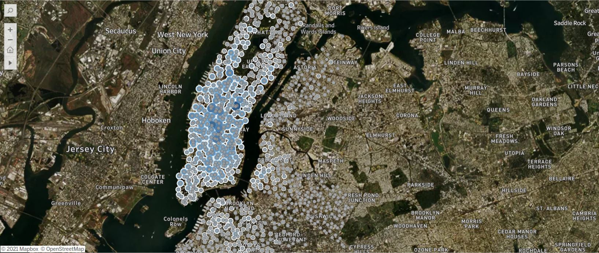
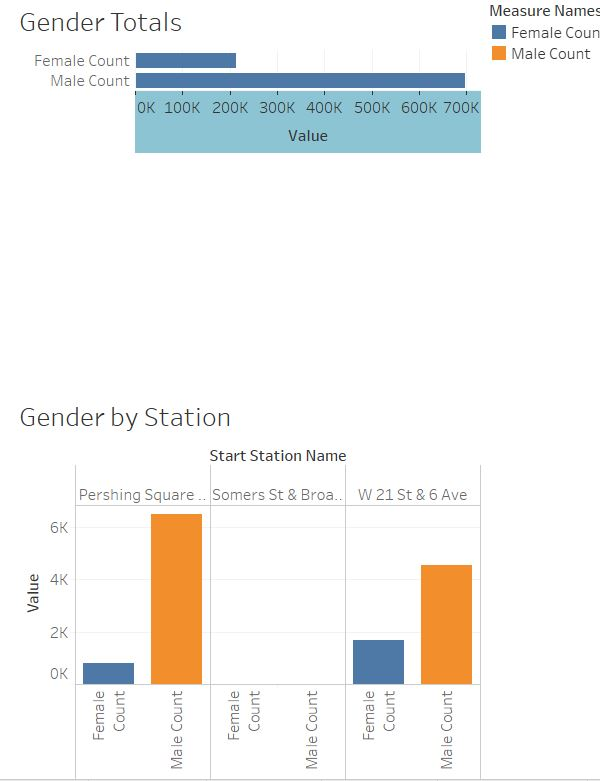
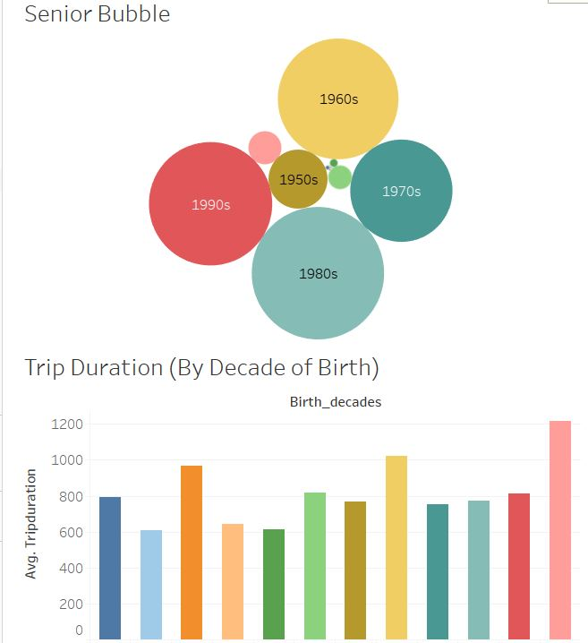

# Cycling Through the Years

Note: more visualizations for this project can be found [**here**](https://public.tableau.com/profile/clark.pfifer#!/vizhome/CyclingThroughtheYears/CityMap?publish=yes). 

This project provides visualizations for CitiBike data using Tableau for December 2019. 

## Analysis

Visualizations provided are here to tackle two trends:

1. Age vs. Trip duration 
2. Station use by gender

First, a csv file for December 2019 is imported into Tabluea. Then, that data is converted into calculated fields encompassing decades and genders. Before tackling each trend, there is a map of Manhattan with circles reflecting the bikeid field (and how large that number is). 

Each trend has two visualizations related to either age or gender. They are then combined into a dashboard and a story for each trend. 

### Gender
 

### Age

Further analysis is explored [**here**](https://github.com/AllCAPs788/citibike_tableau/blob/master/Analysis.md).  

